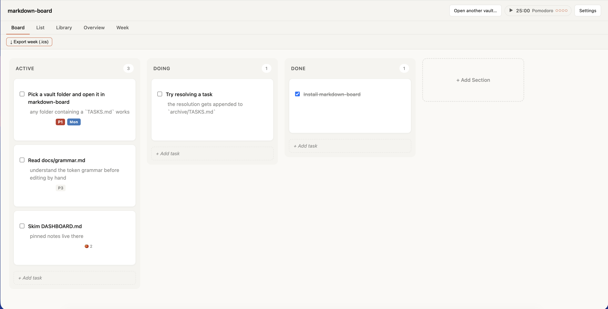
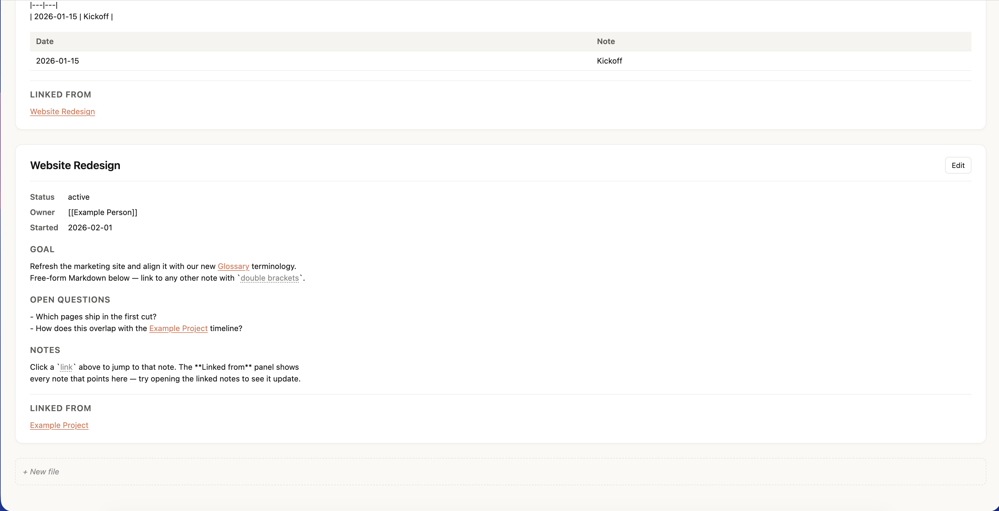
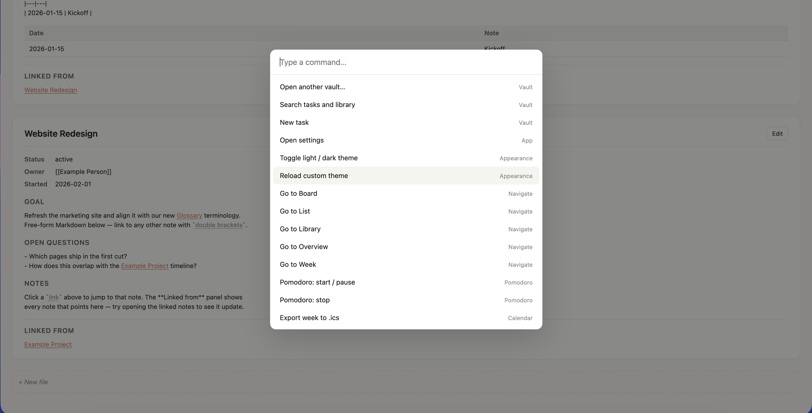
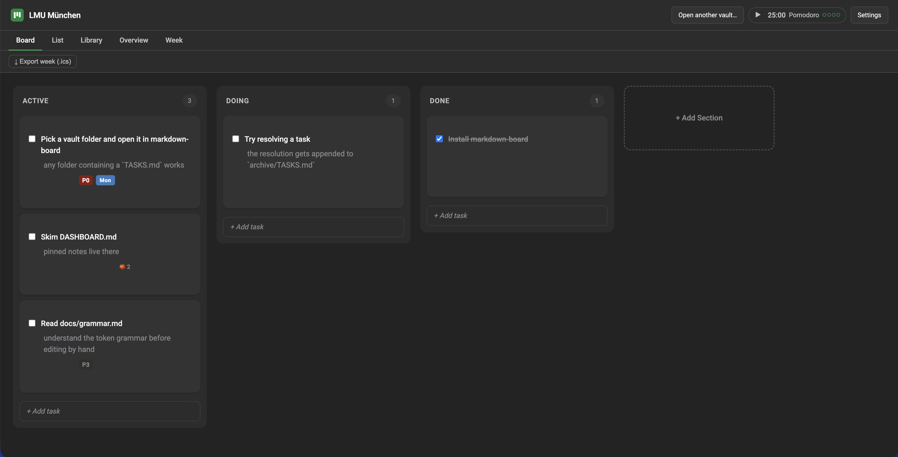

# markdown-board

**Kanban-first knowledge workspace on plain Markdown files you own.**
Local-first, file-based, cross-platform desktop and web. No server, no account,
no cloud.

[](./LICENSE)


<!-- Hero screenshot. Drop docs/assets/hero-board.png in to replace this. -->
[](https://www.marcel-neunhoeffer.com/markdown-board/)

**[Try the live web demo →](https://www.marcel-neunhoeffer.com/markdown-board/)**
(opens a folder on your machine — nothing leaves your device)

> **Status: personal work-in-progress.** This is the rewrite of a single-file
> prototype into a shippable, open-source product. The working name —
> `markdown-board` — is a placeholder; the final brand is settled before public
> 1.0.

---

## Why markdown-board

- **Your files, your folder.** A vault is just a directory of Markdown. Open it
  in any editor; the app never locks you in.
- **Kanban *and* a knowledge base in one.** Drag tasks across columns, and keep
  long-form notes that link to each other with `[[wiki-links]]`.
- **Local-first, no cloud.** No account, no sync server, no telemetry. The app
  reads and writes files directly.
- **Sync however you already do.** Put the vault in iCloud, Dropbox, Syncthing,
  or a git repo — the app handles external edits and conflicts gracefully.
- **Extensible.** A typed plugin API ships with first-party plugins (pomodoro,
  week view, iCal export).
- **Cross-platform.** Native desktop app (macOS / Windows / Linux via Tauri 2)
  plus a zero-install web demo.

## Features

**Board & tasks**
- Kanban columns with drag-and-drop.
- A compact token grammar in `TASKS.md`: `[P0]`–`[P3]` priority, `[Mon]`–`[Sun]`
  day-of-week, `[pom:N]` pomodoro count.
- Resolve a task and it's appended to `archive/TASKS.md`.
- Configurable grammar profile (`default` and `obsidian-tasks`).

**Knowledge base**
- `library/` for long-form notes, with `[[Page]]` and `[[Page|alias]]`
  wiki-links.
- Backlinks panel — see everything that links to the note you're reading.
- Full-text search across tasks and library (MiniSearch), with preview and
  jump-to.

**Productivity**
- Command palette (`Cmd/Ctrl-K`) with fuzzy matching.
- Keyboard shortcuts, documented and remappable.
- Quick-add task modal.

**Make it yours**
- Theming via a `theme.yaml` in the vault root: colors, fonts, logo, light/dark
  variants, hot-reloaded with no restart.
- Per-project color overrides.

**Robust by design**
- External-edit conflict resolution (mine / theirs / merge) when a file changes
  underneath you.
- Auto-update on desktop.

## Screenshots

> Placeholder slots — they render once the PNGs are added under `docs/assets/`.

| Library + backlinks | Command palette | Theming |
| --- | --- | --- |
|  |  |  |

## Try it

**Web demo (nothing to install):** open
[the live demo](https://www.marcel-neunhoeffer.com/markdown-board/) in a Chromium
browser and point it at any folder containing a `TASKS.md`. Files stay on your
machine (it uses the File System Access API).

**Run the web demo locally:**

```bash
corepack enable
pnpm install
pnpm --filter @markdown-board/web dev
```

Then open the printed URL and pick the bundled
[`examples/starter-vault/`](./examples/starter-vault) to see a populated board.

**Run the desktop app (dev):**

```bash
pnpm --filter @markdown-board/desktop tauri dev
```

(Requires the [Tauri 2 prerequisites](https://v2.tauri.app/start/prerequisites/)
for your OS.)

## Install (desktop)

Download a build from the
[Releases page](https://github.com/mneunhoe/markdown-board/releases), or build
from source as above. Platform-specific notes (including unsigned-build
gatekeeping on macOS/Windows) and how auto-update works are in:

- [Installation guide](./docs/installation.md)
- [Auto-update](./docs/auto-update.md)

## How it works

A **vault** is an ordinary folder:

```
my-vault/
├── TASKS.md          # the Kanban board, as Markdown checklists
├── DASHBOARD.md      # optional pinned notes shown in the Overview
├── library/          # long-form notes; [[wiki-links]] resolve here
├── archive/TASKS.md  # resolved tasks land here
└── theme.yaml        # optional theming (colors, fonts, logo)
```

The board state *is* the Markdown — edit `TASKS.md` by hand or in the app, both
work. See the [token grammar](./docs/grammar.md) (work in progress) and the
ready-to-use [`examples/starter-vault/`](./examples/starter-vault).

## Documentation

| Doc | What it covers |
| --- | --- |
| [Installation](./docs/installation.md) | Per-platform install + unsigned-build notes |
| [Auto-update](./docs/auto-update.md) | How desktop updates work |
| [Theming](./docs/theming.md) | `theme.yaml` colors, fonts, logo, light/dark |
| [Keyboard shortcuts](./docs/keyboard-shortcuts.md) | Default bindings + remapping |
| [Sync recipes](./docs/sync-recipes.md) | iCloud / Dropbox / Syncthing / git |
| [Plugins](./docs/plugins.md) | Bundled & third-party plugins, trust model |
| [Plugin API](./docs/plugin-api.md) | Build your own plugin |

## Develop

Requires Node 20+ and pnpm (pinned via
[Corepack](https://nodejs.org/api/corepack.html)):

```bash
corepack enable
pnpm install
pnpm build       # turbo build across all packages
pnpm test        # vitest across the workspace
pnpm lint        # eslint
pnpm typecheck   # tsc + svelte-check
```

### Repository layout

| Path | What it is |
| --- | --- |
| `packages/core` | Pure-TS grammar, model, store — runs in any JS environment |
| `packages/ui` | Svelte 5 components, theme tokens, views |
| `packages/shell` | Platform-agnostic app shell (VaultApp), modals, vault helpers |
| `packages/web` | Vite + Svelte 5 web demo (File System Access API) |
| `packages/desktop` | Tauri 2 desktop shell (native file adapter + watcher) |
| `packages/plugin-api` | Public plugin contract and types |
| `packages/cli` | Headless task ops (placeholder for now) |
| `plugins/*` | First-party plugins: pomodoro, week-view, ical-export |
| `docs/*` | User-facing documentation |
| `examples/starter-vault/` | A ready-to-use workspace folder |
| `notes/*` | Internal hand-off notes |

**Stack:** Svelte 5 · Tauri 2 · TypeScript (strict) · Vite · Vitest · Turbo ·
pnpm.

## Contributing

The repo isn't formally open to contributions yet — see
[`docs/contributing.md`](./docs/contributing.md). Issues and ideas are welcome.

## License

[MIT](./LICENSE)
